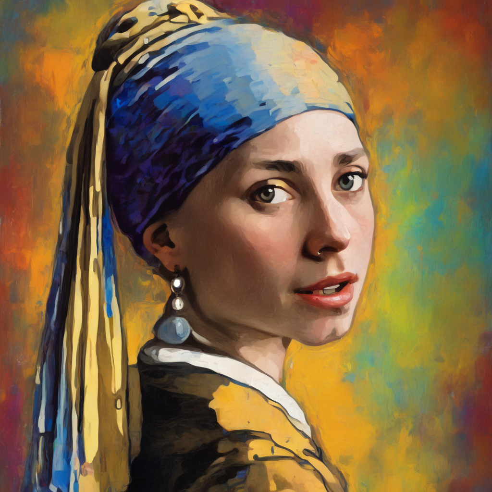
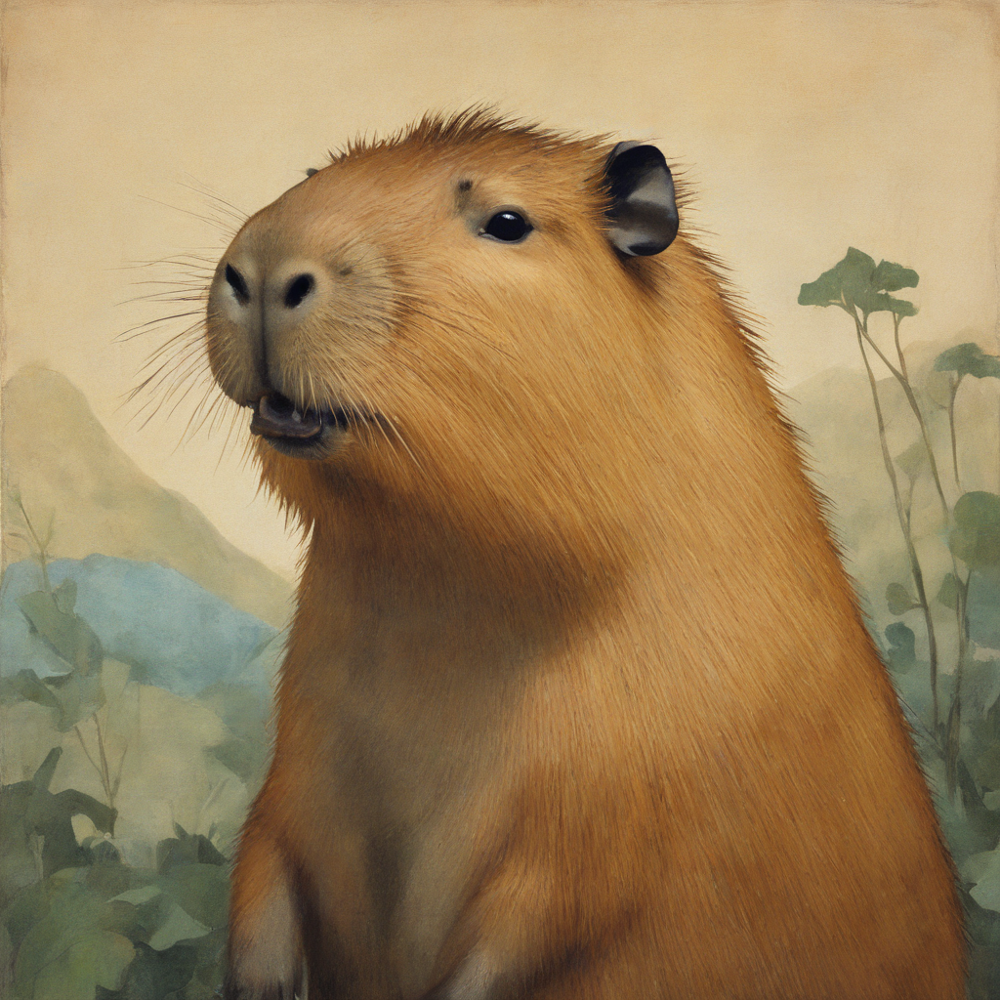
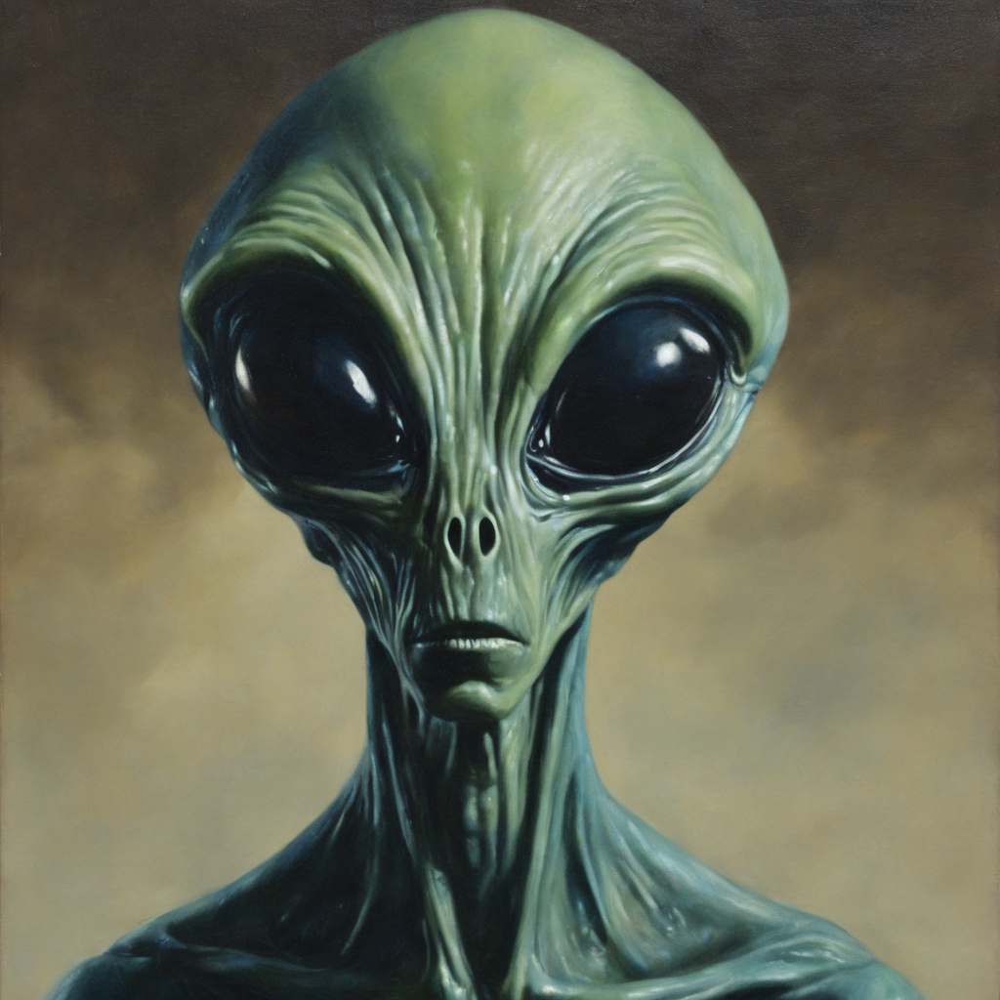

# sdxl-Vermeer

My cog deployment of my stable-diffusion-xl-base-1.0 Lora finetuned on Vermeer paintings 

- API: https://replicate.com/georgedavila/sdxl-Vermeer
- Model: https://huggingface.co/GDavila/sdxl-Vermeer
- Dataset: https://huggingface.co/datasets/GDavila/PaintingsImagesDataset

Trigger word: TOK

## Lora Outputs

"a painting of a modern girl wearing a pearl earring rainbow background, in the style of TOK"

"a painting of a man wearing a VR headset, in the style of TOK"

"a painting of a capybara in the style of TOK"

"A painting of an alien in the style of TOK"

